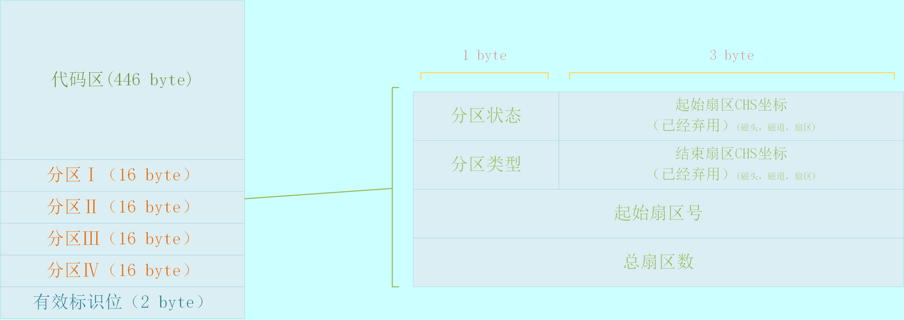

# 主引导扇区

Created by: moon
Created time: November 20, 2023 11:35 PM
Tags: 未完成

### 🖥️主引导扇区

- 概括
    
    MBR磁盘分区都有一个引导扇区，这个扇区称为主引导记录（Master Boot Record），主引导扇区位于整个硬盘的0磁头0柱面1扇区，总共512个字节，其中前面446个字节是用于存放引导代码的，往后的64个字节是磁盘分区表，一共有4个每个占16字节（详细看磁盘分区），最后2个字节为有效标志（有效标识是固定的 0x55 0xaa，用于识别这是一个有效的主引导扇区…个人理解）。可以通过这里去实现加载Boot Loader程序的加载代码，然后通过Boot Loader去加载操作系统，当然如果代码足够紧凑也可以直接在这里加载操作系统。
    
- 引导启动
    
    是指，计算机从BIOS上电自检后到跳转至内核程序执行前这一期间执行的一段或几段程序 这些程序主要用于检测计算机硬件，并配置内核运行时所需的参数 然后再把检测信息和参数提交给内核解析，内核会在解析数据的同时对自身进行配置。引导启动程序曾经分为两部分，Boot和Loader，现在通常合二为一，统称为BootLoader
    
- 结构
    1. 引导代码区：保存可以直接被CPU执行的代码指令，用于启动引导，总共 446 字节。
    2. 磁盘分区表：保存了磁盘的分区信息，共4条记录，每条16字节，共64字节。
    3. 有效标志：占2个字节，通常为0x55和0xAA，表明主引导记录或者分区是有效的。
- 加载位置
    
    引导代码区内的代码会被加载到内存的 0x7C00 的位置并进行执行。
    
- 实验测试
    - 向屏幕打印字符汇编代码
        1. 中断向量表 INT 10H
            
            INT 10H 是一个用于访问视频服务的BIOS中断。他提供了一系列的功能。包括设置显示模式，改变字符和屏幕颜色，移动光标，以及在屏幕上写入字符或字符串。
            
            ```
            (AH) = OOH - Set Mode 
            (AH) = 01H - Set Cursor Type 
            (AH) = 02H - Set Cursor Position 
            (AH) = 03H ~ Read Cursor Position 
            (AH) = 04H - Read Light Pen Position 
            (AH) = 05H - Select Active Display Page 
            (AH) = 06H - Scroll Active Page Up 
            (AH) = 07H - Scroll Active Page Down 
            (AH) = 08H - Read Attribute/Character at Current Cursor Position 
            (AH) = 09H - Write Attribute/Character at Current Cursor Position 
            (AH) = OAH - Write Character at Current Cursor Position 
            (AH) = OSH - Set Color Palette 
            (AH) = OCH - Write Dot 
            (AH) = ODH - Read Dot 
            (AH) = OEH - Write Teletype to Active Page 
            (AH) = OFH - Read Current Video State 
            (AH) = 10H - Set Palette Registers 
            (AH) = 11 H - Character Generator 
            (AH) = 12H - Alternate Select 
            (AH) = 13H - Write String 
            (AH) = 14H - Load LCD Character Font/Set LCD High-Intensity Substitute 
            (AH) = 15H - Return Physical Display Parameters for Active Display 
            (AH) = 16H to 19H - Reserved 
            (AH) = 1AH - Read/Write Display Combination Code 
            (AH) = 1SH - Return Functionality/State Information 
            (AH) = 1CH - Save/Restore Video State 
            (AH) = 1DH to FFH - Reserved
            ```
            
            在这里我们用到了 AH=0EH 的功能，他是用于在Teletype模式下显示字符串，其中，入口参数是 AH=0EH, AL=字符, BH=页码, BL=前景色(需要设置成图形模式)，下面是一个对屏幕输出 SoulOS 的简单且不雅观的汇编代码，注意这个代码只能在虚拟机或者模拟器上运行，无法在物理机上运行，因为没有主引导扇区的分区表，如果在物理机上运行参考下面的制作U盘启动。
            
            <aside>
            💡 相关中断：PS2_and_PC_BIOS_Interface_Technical_Reference_Apr87 这本手册上有清楚说明。地址：[https://archive.org/details/bitsavers_ibmpcps2PSTechnicalReferenceApr87_5816663/page/n11/mode/2up](https://archive.org/details/bitsavers_ibmpcps2PSTechnicalReferenceApr87_5816663/page/n11/mode/2up)
            
            </aside>
            
        
        ```nasm
        [org 0x7c00]
        
        ; 编译指令： nasm -f bin boot.asm -o boot.bin
        ; 设置屏幕模式为文本模式，清除屏幕
        mov ax, 0x0003 ; AH=0x00 设置模式 AL=0x03 文字 80*25 颜色2
        int 0x10
        
        ; 初始化段寄存器
        xor ax, ax
        mov ds, ax
        mov es, ax
        mov ss, ax
        mov sp, 0x7c00
        
        ; 显示文本
        mov ah, 0x0E
        mov al, 'S'
        int 0x10
        mov al, 'o'
        int 0x10
        mov al, 'u'
        int 0x10
        mov al, 'l'
        int 0x10
        mov al, 'O'
        int 0x10
        mov al, 'S'
        int 0x10
        
        ; 阻塞
        jmp $
        
        times 510 - ($ - $$) db 0x00
        
        ; 硬盘最后两个字节必须是 0x55 0xaa
        db 0x55, 0xaa
        ```
        
    - 编译汇编代码
        
        ```
        nasm -f bin boot.asm -o boot.bin
        ```
        
    - 制作img文件(Flat格式)
        
        ```
        yes | ./debug-tools/bochs-2.7/bin/bximage -q -hd=16 -func=create -sectsize=512 -imgmode=flat ./temp/SoulOS.img
        dd if=./temp/boot.bin of=./temp/SoulOS.img bs=512 count=1 conv=notrunc
        ```
        
    - 通过bochs调试
        
        <aside>
        💡 注意：如果需要开启GUI Debugger模式，需要在bochsrc文件中设置 display_library: x, options="gui_debug” ,如果需要开启bochs的魔术中断，需要配置 magic_break: enabled=1 # 这个是bochs的魔术断点，通过(xchg bx, bx)下断点。
        
        </aside>
        
        ```
        	./debug-tools/bochs-2.7/bin/bochs -f ./bochsrc -q
        ```
        
    - 通过VMware调试
    
    占时未做实验
    

### 🛢️磁盘分区

- 磁盘分区表的结构
    
    
    

### 🚀制作U盘启动

### 📒相关资料

<aside>
💡 磁盘分区原理：[磁盘分区原理 | 自制文件系统 (fasionchan.com)](https://fasionchan.com/diy-file-system/disk/partition/)

</aside>

<aside>
💡 BIOS中断向量表：[汇编中的10H中断int 10h详细说明 - 大有|元亨 - 博客园 (cnblogs.com)](https://www.cnblogs.com/JohnShao/archive/2011/06/13/2079638.html)

</aside>

<aside>
💡 计算机的启动逻辑：[计算机是如何启动的？ - 阮一峰的网络日志 (ruanyifeng.com)](http://www.ruanyifeng.com/blog/2013/02/booting.html)

</aside>